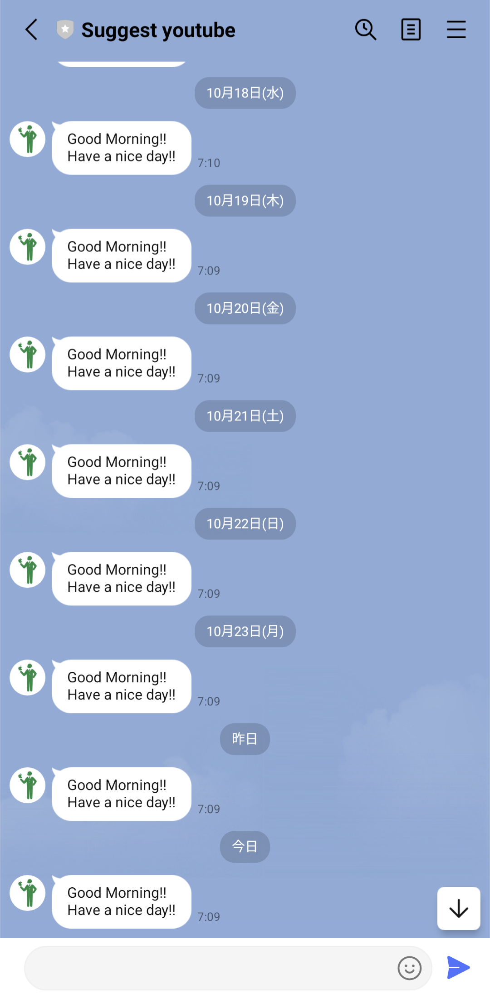
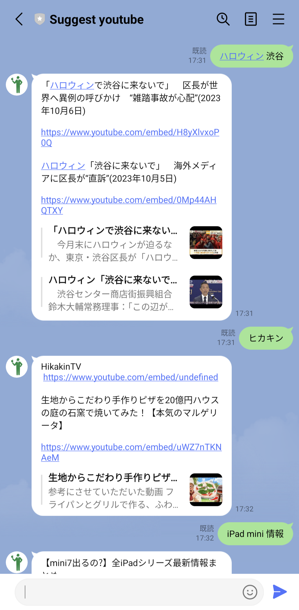

# Suggest YouTube (LINE チャット bot)

URL: https://line.me/R/ti/p/%40799pkytw

## 機能

機能とコードについては、こちらからも確認できます。

https://marked-jaborosa-40b.notion.site/LINE-bot-Suggest-youtube-0b30c1fe23e84573a0ab06666216545d?pvs=4

### 機能 1: 毎朝のアラート

- 言語: Python 3.9
- 使用ライブラリ: json, linebot, linebot.models
- 定期実行: GitHub Actions を使用
- 機能: 毎朝 7 時 10 分頃に "Good morning!! Have a nice day!!"と送信
- 参考: https://youtu.be/T0KAE2kq2Xo

- 使用例

### 機能 2: YouTube の動画のリンクを返信

- 言語: Google Apps Script
- 使用 API: YouTube Data API v3
- 機能: 単語を送信すると、その単語に関連する YouTube 動画のリンク(通常の URL ではなく、html に埋め込む用の URL)を 2 つ返信してくれる
- 確認されているバグ: YouTube Data API では、動画だけでなくチャンネルや再生リストなども返してくれるため、たとえば「ヒカキン」と入力して送信すると、返信してくれる URL の片方が “https://www.youtube.com/embed/undefined”(無効のURL)となってしまう
- 使用例

※上記の 2 つの画像では、2 つの機能が独立しているように見えますが、実際には 2 つの機能が混在しています。
